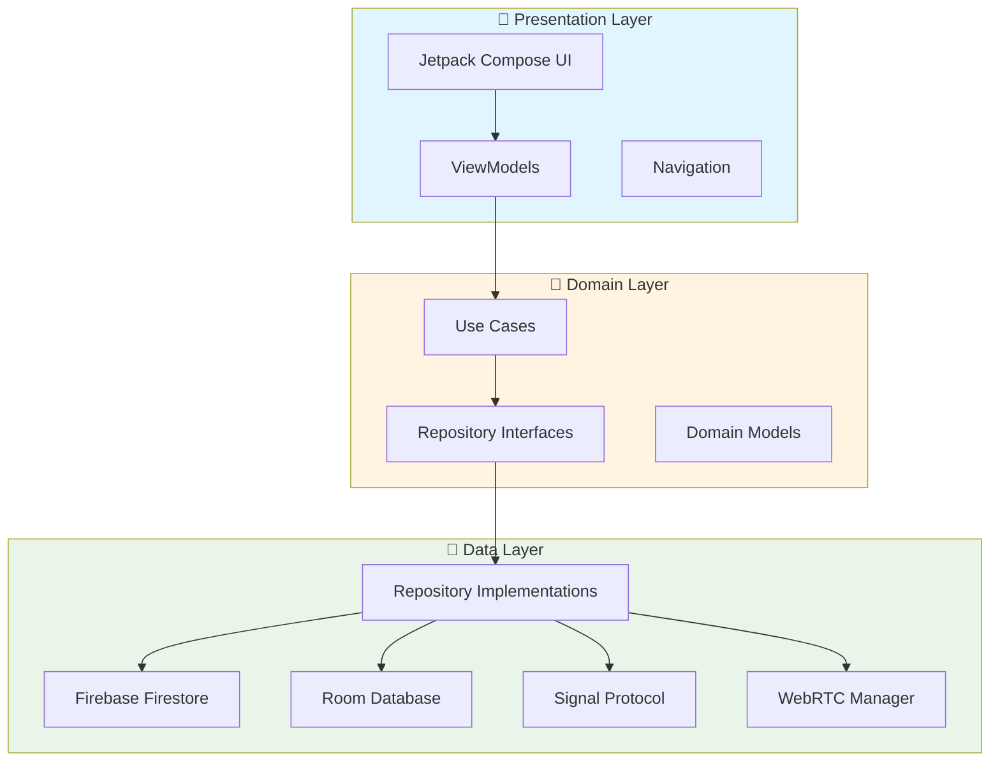
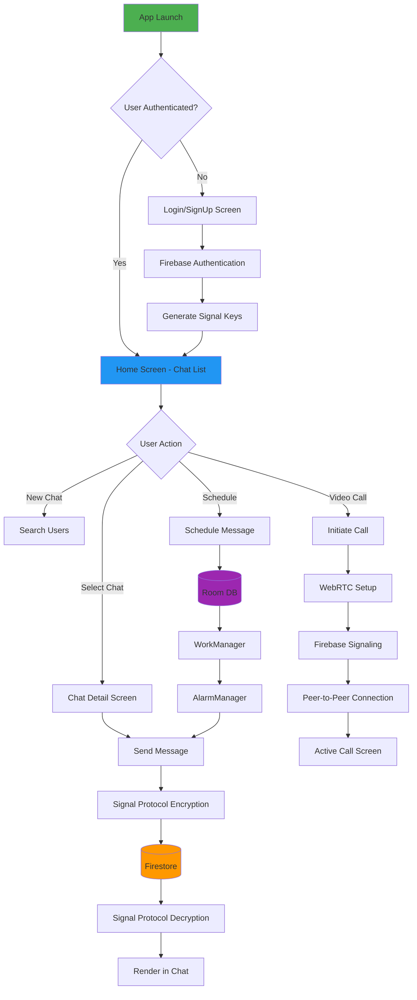

# LetsTalk - Secure, Private, Real-Time Messaging
> **Privacy First. Always Encrypted. Truly Peer-to-Peer.**
> 
> *A production-grade messaging application built with Signal Protocol E2EE, WebRTC calling, and modern Android architecture.*
---
## What is LetsTalk?
**LetsTalk** is not just another chat app—it's a **secure communication platform** that prioritizes your privacy without compromising on features. Built from the ground up with **end-to-end encryption** using the Signal Protocol, LetsTalk ensures that your conversations remain truly private.
### Why LetsTalk Matters
In an era where data privacy is paramount, LetsTalk solves critical problems:
- 🔐 **True End-to-End Encryption**: Implements the Signal Protocol (X3DH + Double Ratchet) - the same encryption used by WhatsApp and Signal. Your server never sees your messages.
- 📞 **Peer-to-Peer Calling**: Custom WebRTC implementation with Firebase signaling for crystal-clear voice and video calls without relying on third-party SDKs.
- 💾 **Offline-First Architecture**: Send messages anytime. They sync automatically when connectivity returns using WorkManager and Room database.
- 🔔 **Reliable Push Notifications (FCM)**: Integrates **Firebase Cloud Messaging (FCM)** to deliver real-time message and call notifications when the app is in the background or killed.
- ⏰ **Message Scheduling & Guaranteed Delivery**: Allows users to schedule messages for future delivery.  
- 🚀 **Modern Android Development**: Built with  Kotlin, Jetpack Compose, MVVM, Clean Architecture, and Hilt DI.
- 🎨 **Premium UI/UX**: Designed with Material 3, supporting both light and dark themes for a delightful user experience.
---

## 📈 Scalability & Performance

LetsTalk is designed to scale horizontally using Firebase infrastructure:

| Capability | Estimated Handling |
|------------|-------------------|
| Concurrent users | 50,000+ (Firestore sharded chats) |
| Messages/day | 1M+ (batch writes & pagination) |
| WebRTC calls | Peer-to-peer (server-free media path) |
| Latency | < 300ms signaling |
| Offline queue | Unlimited (Room DB) |
| Group size | 500+ members |
| Push Notifications | 100K+ devices |

**Why scalable?**
- Firestore uses distributed collections  
- WebRTC media flows P2P (not via server)  
- Pagination + lazy loading  
- Background sync using WorkManager  
- Stateless signaling
- Retry & backoff handled by FCM
---

## 🏗️ Architecture & Technology Stack
LetsTalk follows **Clean Architecture** principles with a clear separation of concerns across three layers.

## 🧰 Technology Stack

### 🧩 Core Technologies

| Category | Technology |
|----------|------------|
| Language | Kotlin (100%) |
| UI Framework | Jetpack Compose + Material 3 |
| Architecture | MVVM + Clean Architecture (3-layer) |
| Dependency Injection | Hilt (Dagger) |
| Async Programming | Kotlin Coroutines + Flow |

---

### ☁️ Backend & Storage

| Category | Technology |
|----------|------------|
| Cloud Database | Firebase Firestore |
| Authentication | Firebase Auth |
| Realtime Presence | Firebase Realtime Database |
| Local Database | Room (SQLCipher encrypted) |
| Push Notifications | Firebase Cloud Messaging (FCM) |

---

### 🔐 Security & Communication

| Category | Technology |
|----------|------------|
| End-to-End Encryption | Signal Protocol (`libsignal-protocol-android`) |
| Voice & Video Calls | WebRTC (Stream WebRTC Android) |
| Media Storage | Cloudinary (Images, Videos, Files) |
| Image Loading | Coil + Glide |

---

### ⚙️ Background Processing

| Category | Technology |
|----------|------------|
| Scheduled Tasks | WorkManager + AlarmManager |
| System Event Handling | BroadcastReceiver (boot completed, network state changes) |

---

### 📚 Supporting Libraries

| Purpose | Library |
|---------|---------|
| JSON Parsing | Kotlinx Serialization / Gson |
| Networking | Retrofit + OkHttp |
| Logging | Timber |
| Pagination | Paging 3 |
| Animations | Compose Animation APIs |
| Permissions | Accompanist Permissions |

---

For complete dependencies, see [`build.gradle.kts`](file:///d:/dev/_framework/kotlin/LetsTalk/app/build.gradle.kts).
---
## 📊 Application Flow

---
## ⭐ Core Features
### 1. 💬 **Advanced Chat System**
> [**Detailed Documentation →**](docs/Chats.md)
- **One-to-One & Group Chats**: Secure messaging with unlimited participants
- **Rich Media Support**: Images, videos, PDFs, voice notes via Cloudinary
- **Message Actions**: Copy, delete, edit, forward, reply with context threading
- **Read Receipts**: Sent ✓, Delivered ✓✓, Seen ✓✓ (blue)
- **User Status**: Real-time online/offline status, last seen timestamps
- **Smart Notifications**: FCM push notifications for messages and mentions
**Key Implementation**:
- [`FirestoreService.kt`](file:///d:/dev/_framework/kotlin/LetsTalk/app/src/main/java/com/exa/android/letstalk/data/repository/FirestoreService.kt) - Message encryption and Firestore operations
- [`ChatViewModel.kt`](file:///d:/dev/_framework/kotlin/LetsTalk/app/src/main/java/com/exa/android/letstalk/presentation/Main/Home/ViewModel/ChatViewModel.kt) - Chat state management
### 2. 🔐 **Signal Protocol End-to-End Encryption**
> [**Detailed Documentation →**](docs/E2E%20Encryption.md)
- **X3DH Key Agreement**: Secure session establishment without prior communication
- **Double Ratchet Algorithm**: Forward secrecy and self-healing properties
- **Multi-Device Support**: Separate encryption for each device
- **Key Rotation**: Automatic pre-key replenishment via WorkManager
**Security Guarantees**:
- ✅ **Forward Secrecy**: Compromised keys cannot decrypt past messages
- ✅ **Future Secrecy**: Self-healing from key compromise
- ✅ **Deniability**: Cryptographic deniability of message authorship
**Key Implementation**:
- [`SignalService.kt`](file:///d:/dev/_framework/kotlin/LetsTalk/app/src/main/java/com/exa/android/letstalk/data/signal_protocol/SignalService.kt) - Encryption/decryption operations
- [`SignalKeyManager.kt`](file:///d:/dev/_framework/kotlin/LetsTalk/app/src/main/java/com/exa/android/letstalk/data/signal_protocol/SignalKeyManager.kt) - Key generation and management
- [`SignalProtocolStoreImpl.kt`](file:///d:/dev/_framework/kotlin/LetsTalk/app/src/main/java/com/exa/android/letstalk/data/repository/SignalProtocolStoreImpl.kt) - Key storage with Room
### 3. 📞 **WebRTC Voice & Video Calling**
> [**Detailed Documentation →**](docs/WebRTC.md)
- **Peer-to-Peer Calls**: Direct media streaming between devices
- **Firebase Signaling**: Firestore-based SDP and ICE candidate exchange
- **Call Features**: Camera toggle, microphone mute, speaker mode
- **Network Resilience**: Automatic ICE candidate gathering, NAT traversal
**Call Flow**:
1. Caller initiates → Creates SDP offer → Uploads to Firestore
2. Callee receives notification → Shows incoming call screen
3. Callee accepts → Creates SDP answer → P2P connection established
4. Media streams directly between devices (audio/video)
**Key Implementation**:
- [`CallWebRTCManager.kt`](file:///d:/dev/_framework/kotlin/LetsTalk/app/src/main/java/com/exa/android/letstalk/data/webrtc/CallWebRTCManager.kt) - WebRTC peer connection management
- [`CallSignalingRepositoryImpl.kt`](file:///d:/dev/_framework/kotlin/LetsTalk/app/src/main/java/com/exa/android/letstalk/data/repository/CallSignalingRepositoryImpl.kt) - Firebase signaling operations
- [`CallViewModel.kt`](file:///d:/dev/_framework/kotlin/LetsTalk/app/src/main/java/com/exa/android/letstalk/presentation/call/CallViewModel.kt) - Call state management
### 4. ⏰ **Message Scheduling**
> [**Detailed Documentation →**](docs/Message_Scheduling.md)
- **Schedule Messages**: Send messages at a future date/time
- **Reliable Delivery**: WorkManager + AlarmManager for precise timing
- **History Tracking**: View sent and pending scheduled messages
- **Boot Persistence**: BroadcastReceiver reschedules on device restart
**Architecture**:
- **Room DB**: Stores scheduled messages locally
- **WorkManager**: Manages background execution with constraints
- **AlarmManager**: Triggers exact alarm at scheduled time
- **BroadcastReceiver**: Handles system events (boot, time changes)
**Key Implementation**:
- [`ScheduleMessageDatabase.kt`](file:///d:/dev/_framework/kotlin/LetsTalk/app/src/main/java/com/exa/android/letstalk/data/local/room/ScheduleMessageDatabase.kt) - Local storage
- [`SendMessageWorker.kt`](file:///d:/dev/_framework/kotlin/LetsTalk/app/src/main/java/com/exa/android/letstalk/core/worker/SendMessageWorker.kt) - Background message sending
- [`BootReceiver.kt`](file:///d:/dev/_framework/kotlin/LetsTalk/app/src/main/java/com/exa/android/letstalk/core/broadcast/BootReceiver.kt) - System event handling
### 5. 🎨 **Modern UI/UX**
- **Material 3 Design**: Latest Material Design components
- **Light & Dark Themes**: Seamless theme switching
- **Jetpack Compose**: Fully declarative UI with smooth animations
- **Responsive Layouts**: Optimized for all screen sizes
- **Google Fonts**: Custom typography for premium feel
---

## Application Screenshots
### 🌞 Light Mode
| **Authentication** | **Chat List** | **Chat Detail** |
|:---:|:---:|:---:|
|  |  |  |
| *Secure Firebase Auth* | *Real-time Chat List* | *Rich Message Bubbles* |
| **Group Chat** | **Video Call** | **Scheduled Messages** |
|:---:|:---:|:---:|
|  |  |  |
| *Multi-user Conversations* | *WebRTC HD Video* | *Message Scheduling* |
### 🌚 Dark Mode
| **Authentication** | **Chat List** | **Chat Detail** |
|:---:|:---:|:---:|
|  |  |  |
| *OLED-Friendly UI* | *Elegant Dark Theme* | *Eye-Comfortable Design* |
| **Group Chat** | **Video Call** | **Scheduled Messages** |
|:---:|:---:|:---:|
|  |  |  |
| *Vibrant Accents* | *Immersive Calling* | *Sleek Interface* |
> **Note**: Add your application screenshots to the `docs/images/` directory with the naming convention shown above.
---

## 📚 Detailed Documentation
| Document | Description |
|:---------|:------------|
| [**Chat Features**](docs/Chats.md) | Complete guide to chat system, media sharing, message actions, status systems, and notifications |
| [**Signal Protocol**](docs/E2E%20Encryption.md) | Deep dive into E2EE implementation, key exchange, and encryption flows |
| [**WebRTC Calling**](docs/WebRTC.md) | Voice/video calling architecture, signaling, and peer connection setup |
| [**Message Scheduling**](docs/Message_Scheduling.md) | Scheduled message implementation with WorkManager and AlarmManager |
| [**Architecture**](docs/Architecture.md) | Complete architecture breakdown, layer responsibilities, and DI setup |
---
## 🚀 Getting Started
### Prerequisites
- **Android Studio**: Arctic Fox or newer
- **Minimum SDK**: Android 8.0 (API 26)
- **Target SDK**: Android 14 (API 34)
- **Kotlin**: 1.9+
- **JDK**: Java 11+
### Setup Instructions
#### 1. Clone the Repository
```bash
git clone https://github.com/Vishal01x/LetsTalk.git
cd LetsTalk
```
#### 2. Firebase Configuration
1. Create a Firebase project at [Firebase Console](https://console.firebase.google.com/)
2. Add an Android app to your Firebase project
   - Package name: `com.exa.android.letstalk`
3. Download `google-services.json` and place it in `app/` directory
4. Enable the following Firebase services:
   - **Authentication**: Email/Password provider
   - **Firestore Database**: Create a database in production mode
   - **Realtime Database**: For presence/online status
   - **Cloud Messaging**: For push notifications
   - **Storage**: For media files (optional, using Cloudinary)
#### 3. Cloudinary Setup (Media Storage)
1. Create a free account at [Cloudinary](https://cloudinary.com/)
2. Get your credentials from the Dashboard:
   - Cloud Name
   - API Key
   - API Secret
3. Add credentials to `local.properties`:
```properties
cloudinary.cloud_name=your_cloud_name
cloudinary.api_key=your_api_key
cloudinary.api_secret=your_api_secret
```
#### 4. Signal Protocol Setup
> **No additional setup required!**
The app automatically generates Signal Protocol keys on first launch:
- Identity Key Pair (long-term)
- Signed Pre Key (medium-term)
- One-Time Pre Keys (100 keys generated initially)
Keys are stored securely using:
- Room Database (encrypted with SQLCipher)
- Android KeyStore for master keys
#### 5. WebRTC Configuration
The app uses public STUN servers by default. For production, configure TURN servers:
In [`CallWebRTCManager.kt`](file:///d:/dev/_framework/kotlin/LetsTalk/app/src/main/java/com/exa/android/letstalk/data/webrtc/CallWebRTCManager.kt), update:
```kotlin
val iceServers = listOf(
    PeerConnection.IceServer.builder("stun:stun.l.google.com:19302").createIceServer(),
    // Add your TURN servers
    PeerConnection.IceServer.builder("turn:your-turn-server.com:3478")
        .setUsername("username")
        .setPassword("password")
        .createIceServer()
)
```
> **Recommended TURN Providers**: Twilio, Xirsys, or self-hosted CoTURN
#### 6. FCM Notification Setup
1. In Firebase Console → Cloud Messaging, note your **Server Key**
2. Update FCM server key in `local.properties` (if using server-side notifications):
```properties
fcm.server_key=your_fcm_server_key
```
3. Ensure FCM is enabled in your Firebase project
#### 7. Build & Run
```bash
# In Android Studio, click Run (Shift+F10)
# Or via command line:
./gradlew installDebug
```
The app will:
1. Generate Signal Protocol keys on first launch
2. Prompt for Firebase authentication
3. Initialize WebRTC components
4. Start listening for incoming messages and calls
---
## 🔒 Security Considerations
### Encryption
- All one-to-one messages are encrypted using Signal Protocol
- Keys are stored in encrypted Room database
- No plaintext messages are stored on the server
### Authentication
- Firebase Authentication with secure token management
- Automatic token refresh and session management
### Network Security
- HTTPS for all network requests
- Certificate pinning (recommended for production)
- STUN/TURN server security for WebRTC
### Data Privacy
- Messages are end-to-end encrypted
- Server only stores encrypted ciphertext
- Local database encrypted with SQLCipher
---
## 🤝 Contributing
Contributions are welcome! Here's how you can help:
1. **Fork the repository**
2. **Create a feature branch**: `git checkout -b feature/amazing-feature`
3. **Commit your changes**: `git commit -m 'Add amazing feature'`
4. **Push to branch**: `git push origin feature/amazing-feature`
5. **Open a Pull Request**
### Development Guidelines
- Follow Kotlin coding conventions
- Write unit tests for new features
- Update documentation for significant changes
- Ensure all tests pass before submitting PR
---
## 📝 License
This project is licensed under the MIT License - see the [LICENSE](LICENSE) file for details.
---
## 🙏 Acknowledgments
- **Signal Protocol**: For making E2EE accessible to developers
- **WebRTC**: For enabling peer-to-peer communication
- **Firebase**: For reliable backend infrastructure
- **Jetpack Compose**: For modern Android UI development
---
## 📧 Contact & Support
- **GitHub**: [@Vishal01x](https://github.com/Vishal01x)
- **Repository**: [LetsTalk](https://github.com/Vishal01x/LetsTalk)
**Found a bug?** [Open an issue](https://github.com/Vishal01x/LetsTalk/issues)
**Have questions?** [Start a discussion](https://github.com/Vishal01x/LetsTalk/discussions)
---
<div align="center">
**Made with ❤️ using Kotlin, Jetpack Compose, and a lot of ☕**
*Privacy is not a feature. It's a fundamental right.*
</div>
