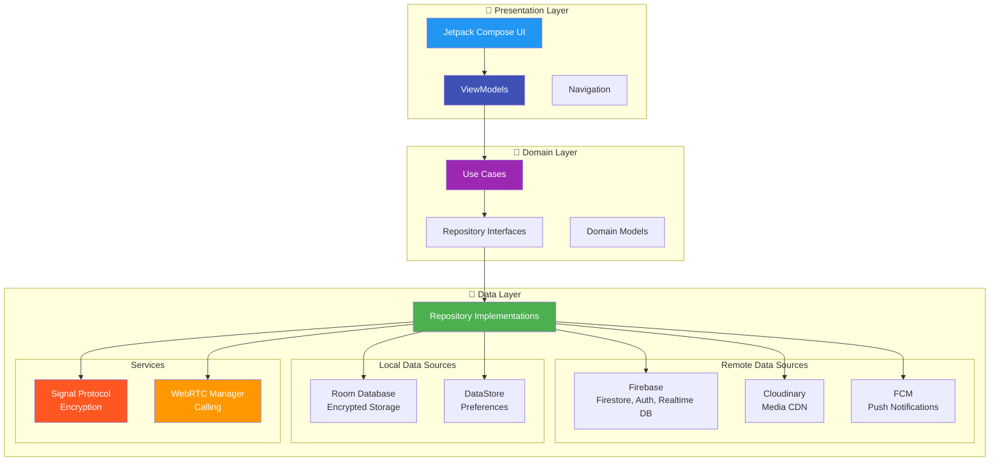
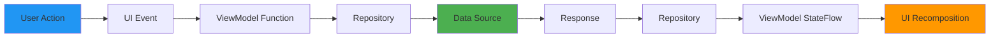
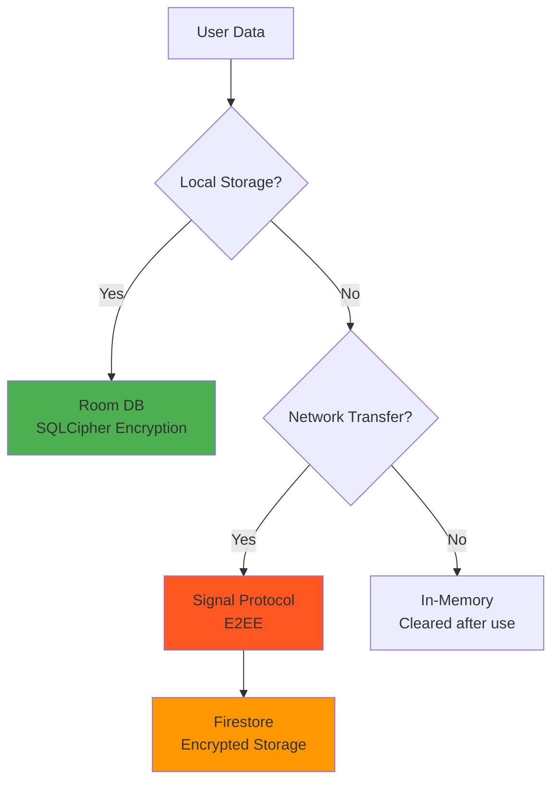

# 🏗️ Architecture - LetsTalk Application Structure
## Overview
- LetsTalk is built following **Clean Architecture** principles with **MVVM** pattern, ensuring clear separation of concerns, testability, and maintainability. This document provides a comprehensive breakdown of the application's architecture, layer responsibilities, and dependency management.
---
## Architecture Diagram

---
## Layer Breakdown
### 1. Presentation Layer (`presentation/`)
**Responsibility**: User Interface and User Interaction
**Components**:
- **Jetpack Compose Screens**: Declarative UI components
- **ViewModels**: State management and business logic coordination
- **Navigation**: App navigation graph using Compose Navigation
#### Package Structure
```
presentation/
├── auth/
│   ├── LoginScreen.kt
│   ├── SignUpScreen.kt
│   └── viewmodels/
│       └── AuthViewModel.kt
├── Main/
│   ├── Home/
│   │   ├── HomeScreen.kt
│   │   └── ViewModel/
│   │       ├── ChatViewModel.kt
│   │       ├── UserViewModel.kt
│   │       └── MediaSharingViewModel.kt
│   ├── scheduledMessages/
│   │   └── ScheduledMessagesScreen.kt
│   └── status/
│       └── StatusViewModel.kt
├── call/
│   ├── CallScreen.kt
│   └── CallViewModel.kt
└── navigation/
    ├── MainAppNavGraph.kt
    └── NavRoutes.kt
```
**Key Principles**:
- ✅ ViewModels never import UI (Compose) components
- ✅ UI observes ViewModel state via StateFlow
- ✅ User actions trigger ViewModel functions
- ✅ No direct access to Repository or Data Layer
**ViewModel Example**:
```kotlin
@HiltViewModel
class ChatViewModel @Inject constructor(
    private val firestoreService: FirestoreService,
    private val userRepository: UserRepository
) : ViewModel() {
    
    private val _messages = MutableStateFlow<Response<List<Message>>>(Response.Loading)
    val messages: StateFlow<Response<List<Message>>> = _messages.asStateFlow()
    
    fun loadMessages(chatId: String) {
        viewModelScope.launch {
            firestoreService.getMessages(chatId).collect { response ->
                _messages.value = response
            }
        }
    }
    
    fun sendMessage(message: Message) {
        viewModelScope.launch {
            firestoreService.sendMessage(message)
        }
    }
}
```
---
### 2. Domain Layer (`domain/`)
**Responsibility**: Business Logic and Contracts
**Components**:
- **Repository Interfaces**: Define data operations without implementation
- **Domain Models**: Core data structures used across the app
- **Use Cases** (optional): Complex business logic workflows
#### Package Structure
```
domain/
├── repository/
│   ├── ChatRepository.kt (interface)
│   ├── AuthRepository.kt (interface)
│   └── CallRepository.kt (interface)
└── models/
    ├── Chat.kt
    ├── Message.kt
    ├── User.kt
    └── Call.kt
```
**Domain Models** (Pure Kotlin, no Android dependencies):
```kotlin
data class Message(
    val messageId: String,
    val chatId: String,
    val senderId: String,
    val message: String,
    val timestamp: Timestamp,
    val status: String, // "sent", "delivered", "seen"
    val media: Media? = null,
    val senderDeviceId: Int = 0,
    val receiverDeviceId: Int = 0,
    val ciphertextType: Int = 0
)
```
---
### 3. Data Layer (`data/`)
**Responsibility**: Data Management and External Communication
**Components**:
- **Repository Implementations**: Concrete implementations of domain interfaces
- **Data Sources**: Firebase, Room, Cloudinary integrations
- **Mappers**: Convert between DTOs and Domain Models
- **Services**: Signal Protocol, WebRTC, FCM
#### Package Structure
```
data/
├── repository/
│   ├── AuthRepository.kt (implementation)
│   ├── FirestoreService.kt
│   ├── UserRepository.kt
│   ├── MediaSharingRepository.kt
│   ├── CallSignalingRepository.kt
│   ├── CallSignalingRepositoryImpl.kt
│   └── SignalProtocolStoreImpl.kt
├── local/
│   └── room/
│       ├── ScheduleMessageDatabase.kt
│       ├── ScheduleMessageDao.kt
│       └── crypto/
│           ├── CryptoDao.kt
│           ├── PreKeyEntity.kt
│           └── [other key entities]
├── signal_protocol/
│   ├── DeviceInitializer.kt
│   ├── SignalKeyManager.kt
│   └── SignalService.kt
├── webrtc/
│   └── CallWebRTCManager.kt
└── api/
    └── [Cloudinary/FCM services]
```
**Repository Pattern Example**:
```kotlin
interface UserRepository {
    suspend fun getCurrentUser(): User?
    suspend fun searchUser(phone: String): Flow<Response<User?>>
    suspend fun updateUserStatus(status: String)
}
class UserRepositoryImpl @Inject constructor(
    private val firestore: FirebaseFirestore,
    private val auth: FirebaseAuth
) : UserRepository {
    override suspend fun getCurrentUser(): User? {
        val uid = auth.currentUser?.uid ?: return null
        return firestore.collection("users")
            .document(uid)
            .get()
            .await()
            .toObject<User>()
    }
    
    // ... other implementations
}
```
---
## Dependency Injection (Hilt)
### Module Structure
```
core/di/
├── AppModule.kt
├── DatabaseModule.kt
├── FirebaseModule.kt
├── SignalProtocolModule.kt
└── WebRTCModule.kt
```
### Key Modules
#### AppModule
```kotlin
@Module
@InstallIn(SingletonComponent::class)
object AppModule {
    @Provides
    @Singleton
    fun provideContext(@ApplicationContext context: Context): Context = context
}
```
#### FirebaseModule
```kotlin
@Module
@InstallIn(SingletonComponent::class)
object FirebaseModule {
    @Provides
    @Singleton
    fun provideFirebaseAuth(): FirebaseAuth = FirebaseAuth.getInstance()
    
    @Provides
    @Singleton
    fun provideFirestore(): FirebaseFirestore = FirebaseFirestore.getInstance()
    
    @Provides
    @Singleton
    fun provideRealtimeDatabase(): FirebaseDatabase = FirebaseDatabase.getInstance()
}
```
#### SignalProtocolModule
```kotlin
@Module
@InstallIn(SingletonComponent::class)
object SignalProtocolModule {
    @Provides
    @Singleton
    fun provideSignalKeyManager(
        @ApplicationContext context: Context
    ): SignalKeyManager = SignalKeyManager(context)
    
    @Provides
    @Singleton
    fun provideSignalService(
        signalStore: SignalProtocolStoreImpl
    ): SignalService = SignalService(signalStore)
}
```
### Scope Management
| Scope | Lifecycle | Usage |
|:------|:----------|:------|
| `@Singleton` | Application lifetime | Repositories, Databases, Firebase instances |
| `@ViewModelScoped` | ViewModel lifetime | Use cases specific to one ViewModel |
| `@ActivityRetainedScoped` | Activity retained | WebRTC manager (survives config changes) |
---
## Data Flow
### Unidirectional Data Flow

**Example Flow - Sending a Message**:
1. **User Action**: User types message and taps "Send"
2. **UI Event**: `ChatScreen` calls `viewModel.sendMessage(message)`
3. **ViewModel**: `ChatViewModel.sendMessage()` calls `firestoreService.sendMessage()`
4. **Repository**: `FirestoreService` encrypts message via `SignalService`
5. **Data Source**: Encrypted message uploaded to Firestore
6. **Response**: Firestore returns success
7. **ViewModel Update**: Messages StateFlow emits new list
8. **UI Recomposition**: Compose observes StateFlow and updates UI
---
## Technology Stack Summary
### Core
- **Language**: Kotlin 100%
- **UI**: Jetpack Compose 1.5+
- **Architecture**: MVVM + Clean Architecture
- **DI**: Hilt 2.51.1
- **Async**: Coroutines + Flow
### Data & Backend
- **Cloud DB**: Firebase Firestore
- **Auth**: Firebase Authentication
- **Realtime**: Firebase Realtime Database
- **Local DB**: Room 2.6.1 (SQLCipher encrypted)
- **Preferences**: DataStore
- **Media**: Cloudinary
- **Notifications**: Firebase Cloud Messaging
### Security & Communication
- **Encryption**: Signal Protocol (`org.whispersystems:signal-protocol-android:2.8.1`)
- **WebRTC**: Stream WebRTC Android 1.1.3
- **Image Loading**: Coil 2.4.0 + Glide
### Background Processing
- **Work**: WorkManager
- **Alarms**: AlarmManager
- **Events**: BroadcastReceiver
---
## Key Design Patterns
### 1. Repository Pattern
- Abstracts data sources from ViewModels
- Single source of truth for data operations
- Easy to mock for testing
### 2. Observer Pattern
- ViewModels expose StateFlow
- UI observes and reacts to state changes
- Automatic recomposition in Compose
### 3. Dependency Injection
- Hilt manages object graph
- Constructor injection for testability
- Scoped instances for lifecycle management
### 4. Factory Pattern
- `CallWebRTCManager` creates PeerConnection instances
- `SignalKeyManager` generates encryption keys
- WorkManager creates Worker instances
---
## Error Handling Strategy
### Response Wrapper
```kotlin
sealed class Response<out T> {
    object Loading : Response<Nothing>()
    data class Success<T>(val data: T) : Response<T>()
    data class Error(val message: String) : Response<Nothing>()
}
```
### Usage in Repository
```kotlin
fun getChatList(userId: String): Flow<Response<List<Chat>>> = callbackFlow {
    trySend(Response.Loading)
    
    try {
        val listener = firestore.collection("chats")
            .addSnapshotListener { snapshot, exception ->
                if (exception != null) {
                    trySend(Response.Error(exception.message ?: "Unknown error"))
                } else {
                    val chats = snapshot?.toObjects<Chat>() ?: emptyList()
                    trySend(Response.Success(chats))
                }
            }
        awaitClose { listener.remove() }
    } catch (e: Exception) {
        emit(Response.Error(e.message ?: "Failed to load chats"))
    }
}
```
---
## Testing Strategy
### Unit Tests
- **ViewModels**: Test state changes and business logic
- **Repositories**: Mock data sources, test data transformation
- **Use Cases**: Test complex business workflows
### Integration Tests
- **Database**: Test Room DAOs with actual database
- **Signal Protocol**: Test encryption/decryption flows
- **Network**: Test Firestore operations with emulator
### UI Tests
- **Compose**: Test UI components in isolation
- **Navigation**: Test navigation flows
- **End-to-End**: Test critical user journeys
---
## Performance Considerations
### 1. Lazy Loading
- Firestore queries paginated
- Images loaded on-demand with Coil
- Messages loaded in batches
### 2. Caching
- Room database caches messages offline
- Coil caches images in memory and disk
- DataStore caches user preferences
### 3. Background Processing
- Heavy operations (encryption, uploads) in IO dispatcher
- WorkManager for deferrable tasks
- Coroutines for structured concurrency
### 4. Memory Management
- ViewModels cleared when no longer needed
- Firestore listeners removed in `awaitClose`
- Bitmap recycling for large images
---
## Security Architecture

**Security Layers**:
1. **Transport**: HTTPS for all network requests
2. **Storage**: SQLCipher for local database encryption
3. **Messages**: Signal Protocol E2EE
4. **Authentication**: Firebase Auth tokens with automatic refresh
5. **Keys**: Android KeyStore for master encryption keys
---
## Summary
LetsTalk architecture provides:
- **Separation of Concerns**: Clear layer boundaries  
- **Testability**: Dependency injection and abstraction  
- **Scalability**: Modular design for easy feature addition  
- **Maintainability**: SOLID principles and clean code  
- **Performance**: Optimized data flow and caching  
- **Security**: Multi-layer encryption and secure storage  
**Result**: A robust, maintainable, and scalable messaging application built on modern Android development practices.
---
For detailed implementation, see:
- [Chat Features](CHAT.md) - Messaging implementation
- [Signal Protocol](SIGNAL_PROTOCOL.md) - Encryption layer
- [WebRTC Calling](WEBRTC_CALLING.md) - Calling implementation
- [Message Scheduling](MESSAGE_SCHEDULING.md) - Background processing
