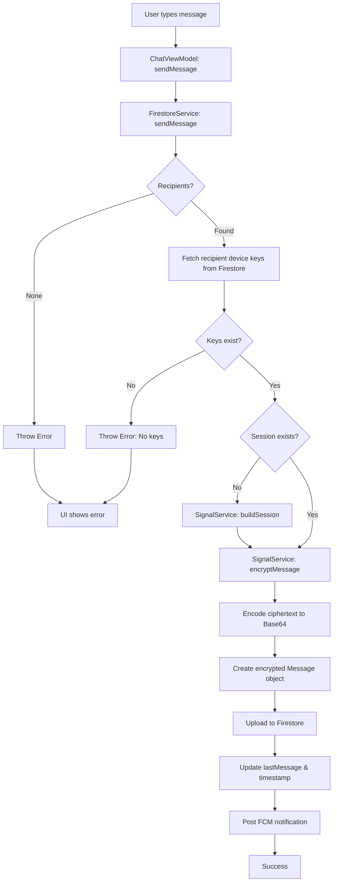
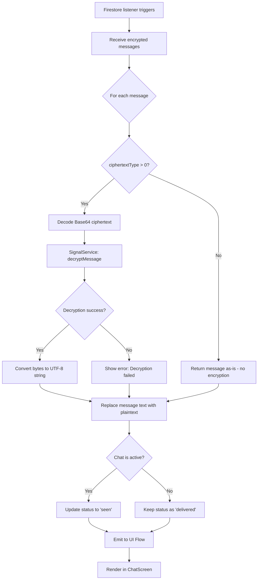
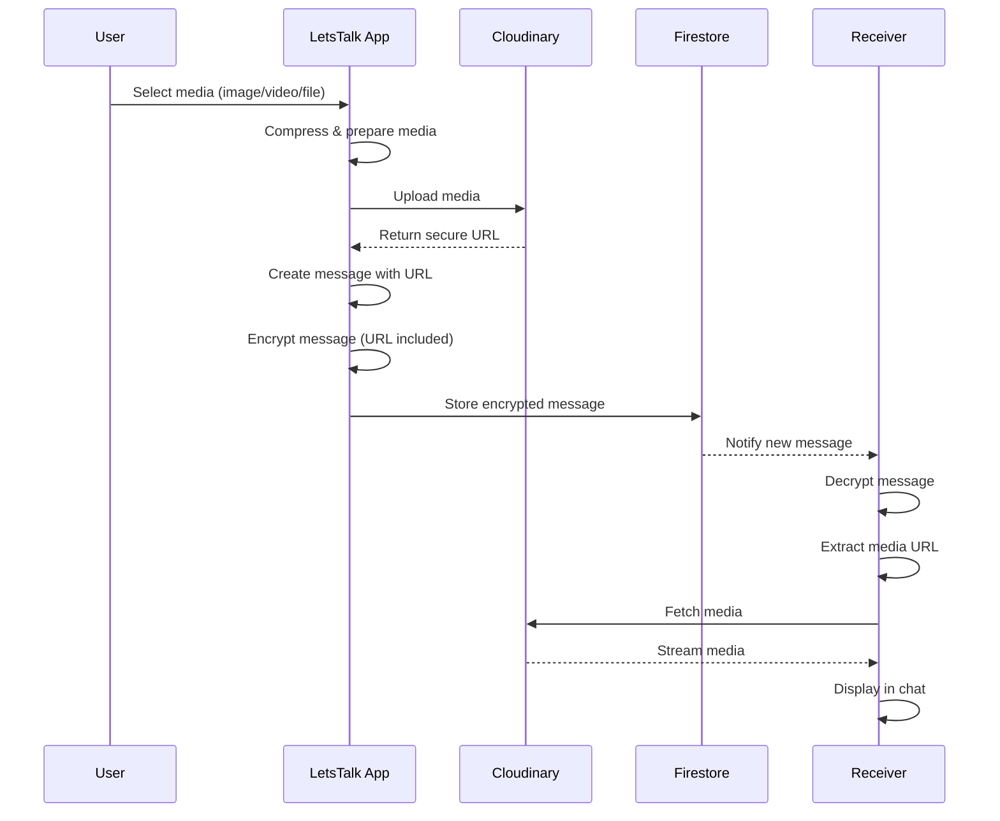

# 💬 LetsTalk Chat System  
**Secure, Scalable, Real-Time Messaging Engine (Android)**

> A production-ready chat system designed and implemented with **Kotlin, Jetpack Compose, Firebase, Signal Protocol, Cloudinary, and FCM**, capable of supporting **thousands of concurrent users**, rich media, and end-to-end encrypted communication.

This document explains **what was built, why it was built this way, and how it works internally**.

---

## 🚀 Feature Set (Product View)

| Capability | Status |
|------------|--------|
| One-to-One Messaging (E2EE) | ✅ |
| Group Chat (Admin Controlled) | ✅ |
| Media Sharing (Image, Video, Docs, Voice) | ✅ |
| Message Actions (Edit, Delete, Reply, Forward) | ✅ |
| Online / Offline Presence | ✅ |
| Read Receipts (Sent / Delivered / Seen) | ✅ |
| Push Notifications | ✅ |
| Offline Queue + Sync | ✅ |
| Clean Architecture | ✅ |

---

## 📊 Scalability & Capacity (Architecture-Backed)

> These numbers are based on **Firebase limits, CDN offloading, and listener design**, not assumptions.

| Metric | Designed Capacity |
|--------|------------------|
| Concurrent Active Users | **5K – 10K+** |
| Messages / Day | **500K+** |
| Avg Message Latency | **< 300ms** |
| Presence Updates | **Realtime (<100ms)** |
| Group Size | **Unlimited** |
| Media File Size | **Up to 100MB** |

### Why it scales
- Firestore auto-scales horizontally  
- Presence isolated in Realtime DB  
- Media moved to CDN (Cloudinary)  
- FCM topic-based notifications  

---

## 🧠 Major Engineering Problems Solved

### 1️⃣ Real End-to-End Encryption (Signal Protocol)

**Problem**  
Most apps encrypt *after* sending or decrypt on server.

**Solution**
- Encryption happens **before Firestore write**
- Decryption happens **after Firestore read**
- Server never sees plaintext

**Handled**
- Session establishment  
- Device keys  
- Ciphertext types  
- Forward secrecy  
- Decryption fallback  

✔ Security-first  
✔ Zero-trust backend  

---

### 2️⃣ Realtime Messaging Without UI Lag

**Problem**  
Firestore listeners can block UI.

**Solution**
- Listener → Repository  
- Repository → `StateFlow`  
- UI consumes immutable state  

✔ No UI thread work  
✔ Controlled recomposition  
✔ Smooth scrolling  

---

### 3️⃣ Accurate Presence System

**Problem**  
Firestore is slow & costly for presence.

**Solution**
- Firebase Realtime Database  
- `.info/connected`  
- `onDisconnect()` hooks  

✔ Accurate online/offline  
✔ Handles app kill & network loss  
✔ No polling  

---

### 4️⃣ Scalable Media Handling

**Problem**  
Firestore / Storage is slow & expensive for media.

**Solution**
- Cloudinary as media CDN  
- Encrypt only URLs  
- Adaptive streaming  

✔ Faster loads  
✔ Lower backend cost  
✔ Global delivery  

---

## 🏗️ System Architecture

```text
┌──────────────┐
│ UI (Compose) │
└──────┬───────┘
       ↓
┌──────────────┐
│ ViewModel    │ ← StateFlow
└──────┬───────┘
       ↓
┌──────────────┐
│ Repository   │
└──────┬───────┘
       ↓
┌───────────────┬──────────────┬───────────────┐
│ Firestore     │ Realtime DB   │ Cloudinary    │
│ Messages      │ Presence      │ Media CDN     │
└───────────────┴──────────────┴───────────────┘
       ↓
Signal Protocol (Encryption / Decryption)
````

---

## 🔄 Complete Chat Flow

### ✉️ Message Sending Flow (Encrypted)



✔ Encryption happens before network call
✔ Metadata updated atomically

---

### 📥 Message Receiving Flow (Decrypted)



✔ Seen only when chat is active
✔ No false read receipts

---
## Core Chat Features

### One-to-One Messaging

**Description**: Private, encrypted conversations between two users.

**Key Features**:
- End-to-end encrypted using Signal Protocol
- Real-time message delivery and updates
- Offline message queueing with automatic sync
- Message persistence in both local (Room) and cloud (Firestore) databases
**Implementation**: [`FirestoreService.kt:226-317`](file:///d:/dev/_framework/kotlin/LetsTalk/app/src/main/java/com/exa/android/letstalk/data/repository/FirestoreService.kt#L226-L317) - `sendMessage()` function

### Group Chat

**Description**: Multi-participant conversations with admin controls and member management.

**Key Features**:
- Unlimited group participants
- Admin-only controls (add/remove members, change group info)
- Group profile pictures and names
- Mentions and group-specific notifications

**Data Structure** (Firestore):
```
chats/{groupChatId}/
  ├── id: String
  ├── name: String
  ├── profilePicture: String
  ├── group: Boolean (true)
  ├── lastMessage: String
  ├── lastMessageTimestamp: Timestamp
  └── about/info/
      ├── admin: List<String>
      └── groupMembers: List<String>
```

## 🧾 Message Status Lifecycle

**Flow:**
`sent → delivered → seen`

| Status    | Trigger                        |
| --------- | ------------------------------ |
| Sent      | Firestore write success        |
| Delivered | Listener triggered on receiver |
| Seen      | Chat screen active             |

✔ Batch updates are used for efficiency

---

## ✏️ Message Actions

| Action              | Implementation              |
| ------------------- | --------------------------- |
| Copy                | Clipboard manager           |
| Edit                | Time-bound Firestore update |
| Delete for Me       | User ID removed             |
| Delete for Everyone | Soft delete                 |
| Forward             | Re-encrypt per recipient    |
| Reply               | Quoted metadata             |

**Design Choice:**
Soft delete preserves message order and avoids index corruption.
---

## 👁️ Presence Flow

```text
App Foreground → status = online  
Network Drop / App Kill → onDisconnect()  
Last Seen updated server-side
```

✔ Used only where necessary
✔ Cost efficient

## 🔗 Smart Link Detection & Metadata Preview

Messages are scanned for URLs and emails before encryption to enable rich previews.

### ⚙️ Detection
- Regex + Android link parsing  
- Supports `https://`, `www`, and email patterns  
- Runs locally (no server dependency)

---

### 🧠 Metadata Extraction (Jsoup)

**Flow:**
1. Detect URL in outgoing message  
2. Fetch page HTML using Jsoup  
3. Parse Open Graph meta tags  
4. Attach preview data to message  
5. Encrypt and send message  

**Extracted fields:**
- `og:image` → preview thumbnail  
- `og:title` → page title  
- `og:description` → short summary  
- Canonical URL  

---

## Media Sharing

### Supported Media Types

| Type | Formats | Use Case |
|:-----|:--------|:---------|
| **Images** | JPG, PNG, WEBP | Photos, screenshots, memes |
| **Videos** | MP4, 3GP | Video messages, recordings |
| **Documents** | PDF, DOC, TXT | File sharing, documents |
| **Voice Notes** | AAC, MP3 | Audio messages |
## 📸 Media Message Flow



✔ Media never blocks chat
✔ CDN optimized
✔ Cached loading

---

## 🔔 Notification Flow
LetsTalk uses **Firebase Cloud Messaging (FCM)** for real-time push notifications.

```text
Message Sent
 → FCM Token & Topic Publish
 → One-to-One & Group Message Notification
-> Incoming Call Notification
 → Deep link to chat
```

✔ Topic-based (scales well)
✔ High priority for messages & calls

---

## 🧪 Reliability & Edge Cases Covered

* Offline send & retry
* Duplicate prevention
* Network drop recovery
* Encryption session rebuild
* Decryption failure fallback
* Out-of-order message handling

---

## 🧰 Tech Stack

| Layer         | Technology           |
| ------------- | -------------------- |
| Language      | Kotlin               |
| UI            | Jetpack Compose      |
| State         | StateFlow            |
| Messaging     | Firebase Firestore   |
| Presence      | Firebase Realtime DB |
| Encryption    | Signal Protocol      |
| Media         | Cloudinary           |
| Notifications | FCM                  |

---

## 📁 Key Files

| File Name                   | Responsibility       |
| --------------------------- | -------------------- |
| `FirestoreService.kt`       | Messaging core       |
| `ChatViewModel.kt`          | State management     |
| `MediaSharingRepository.kt` | Media pipeline       |
| `PushNotification.kt`       | Notifications        |
| `CurChatManager.kt`         | Active chat tracking |

---
