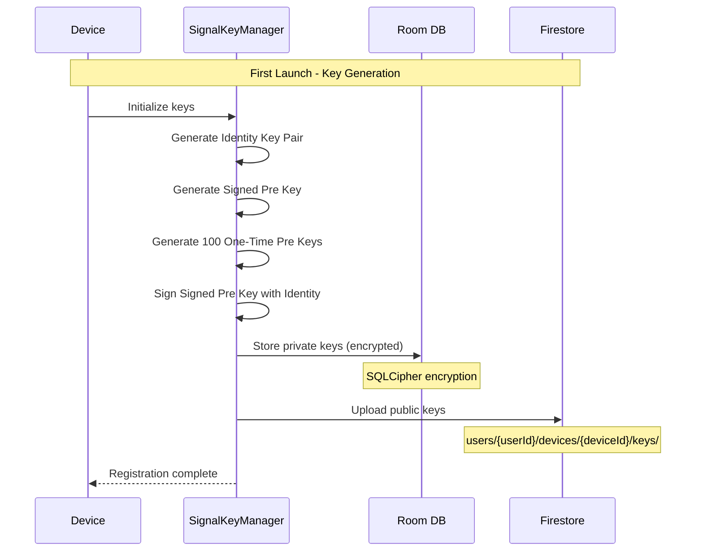
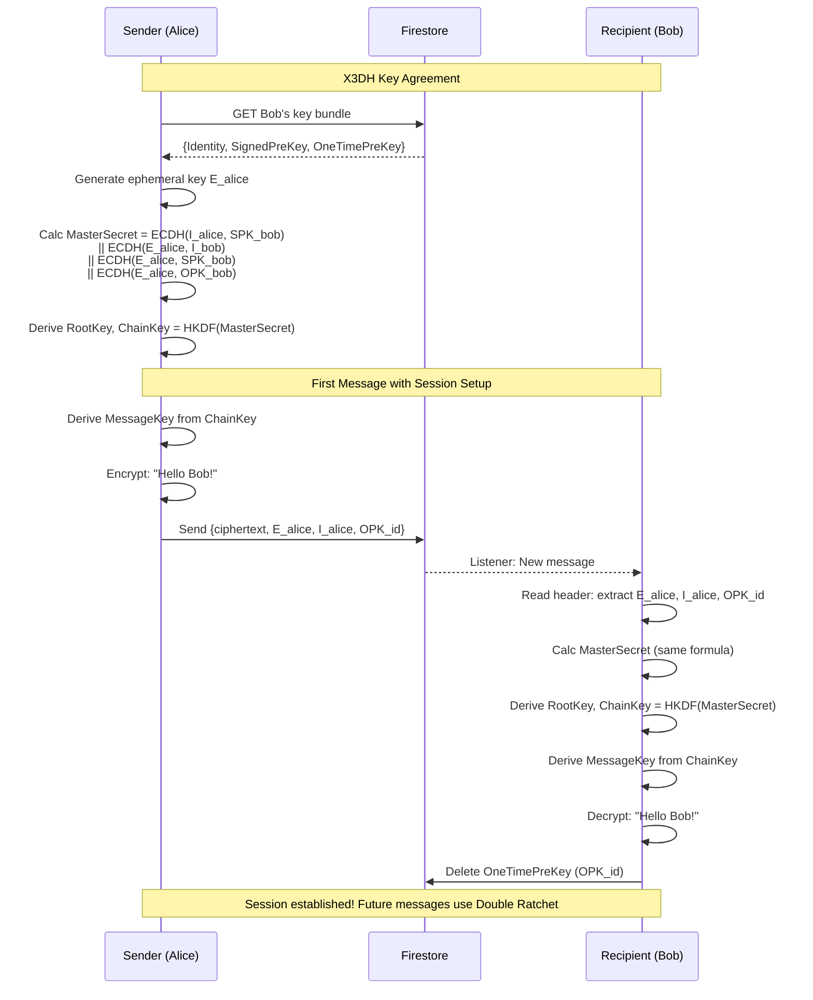
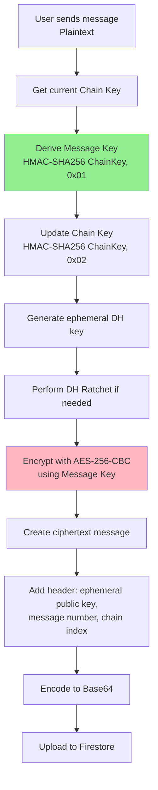
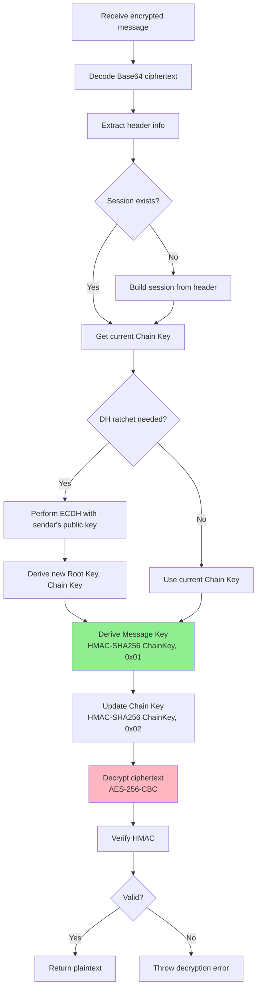

# 🔐 Signal Protocol Implementation (End-to-End Encryption)
## Overview
LetsTalk implements the **Signal Protocol** as the foundation for secure 1:1 messaging sessions. The implementation is based on the Open Source library [`libsignal-protocol-android`](https://github.com/signalapp/libsignal-protocol-java/), providing military-grade end-to-end encryption with forward secrecy.
> **What is Signal Protocol?**
>
> The Signal Protocol (formerly known as the Axolotl protocol) is a cryptographic protocol that provides end-to-end encryption for instant messaging conversations. It's the same protocol used by WhatsApp, Signal, Facebook Messenger, and Skype to protect billions of messages daily.
---
## Top Security Challenges Solved
| Security Challenge                  | Potential Risk                                                               | Solution Implemented                                                                                                                                                         |
| ----------------------------------- | ---------------------------------------------------------------------------- | ---------------------------------------------------------------------------------------------------------------------------------------------------------------------------- |
| **Eavesdropping / Interception**    | An attacker intercepts messages on the network to read sensitive content     | All messages are **end-to-end encrypted (AES-256-CBC)**. Server only stores ciphertext; plaintext never leaves the device.                                                   |
| **Key Compromise / Device Theft**   | If a device is stolen, past or future messages could be decrypted            | **Forward Secrecy & Future Secrecy** via Double Ratchet Algorithm: past messages cannot be decrypted (forward), and next messages ratchet to new keys (future/self-healing). |
| **Replay Attacks**                  | An attacker resends an old message to confuse the recipient                  | Each message has a **unique message number and chain index**, preventing replay or reordering attacks.                                                                       |
| **Man-in-the-Middle (MITM) Attack** | Attacker tries to impersonate a user to intercept messages                   | **Identity Key verification** during X3DH session setup ensures that the sender is communicating with the correct recipient.                                                 |
| **Compromised Session Keys**        | If session state is exposed temporarily, future messages could be vulnerable | **DH Ratchet on each message round-trip** generates new Root & Chain Keys, making old keys useless and protecting future messages.                                           |

## key Features
| Feature                           | Description                                                                               |
| --------------------------------- | ----------------------------------------------------------------------------------------- |
| **End-to-End Encryption**         | All messages encrypted using AES-256 and HMAC-SHA256. Only sender & receiver can decrypt. |
| **Forward Secrecy**               | Each message uses a unique key. Compromised keys cannot decrypt past messages.            |
| **Future Secrecy / Self-Healing** | DH ratchet ensures session recovers even after key compromise.                            |
| **Multi-Device Support**          | Messages encrypted separately for each device.                                            |
| **Automatic Key Management**      | Keys are generated, rotated, and replenished automatically.                               |
| **Secure Local Storage**          | All cryptographic material stored in **encrypted Room database (SQLCipher)**.             |

## Protocol Overview
The Signal Protocol combines two key algorithms:
1. **X3DH (Extended Triple Diffie-Hellman)**: For establishing a shared secret key between two parties who mutually authenticate each other based on public keys.
2. **Double Ratchet Algorithm**: For providing cryptographic secrecy, forward secrecy, and managing ongoing message exchange.
### Why Two Algorithms?
- **X3DH**: Solves the "asynchronous messaging" problem. Users can send messages even if the recipient is offline, without requiring a real-time key exchange.
- **Double Ratchet**: Ensures that every message uses a different encryption key, and compromised keys cannot decrypt past or future messages.
---
## Cryptographic Terms
### Public Key Types
| Key Type | Lifetime | Purpose |
|:---------|:---------|:--------|
| **Identity Key Pair** | Long-term | Generated at registration. Represents user's cryptographic identity. Used for authentication. |
| **Signed Pre Key** | Medium-term | Generated at registration, signed by Identity Key. Rotated every 30 days. Used for initial key agreement. |
| **One-Time Pre Keys** | Single use | Queue of ephemeral keys (100 generated initially). Consumed once per session. Provides forward secrecy. |
### Session Key Types
| Key Type | Size | Purpose |
|:---------|:-----|:--------|
| **Root Key** | 32 bytes | Master key used to derive Chain Keys. Updates with each DH ratchet. |
| **Chain Key** | 32 bytes | Used to derive Message Keys. Ratchets forward with each message. Separate for sending and receiving. |
| **Message Key** | 80 bytes | Encrypts a single message. Derived from Chain Key. Components: 32B AES-256 key + 32B HMAC-SHA256 key + 16B IV |
### Cryptographic Operations
- **ECDH**: Elliptic Curve Diffie-Hellman key agreement (using Curve25519)
- **HMAC-SHA256**: Hash-based Message Authentication Code
- **HKDF**: HMAC-based Key Derivation Function
- **AES-256-CBC**: Advanced Encryption Standard in Cipher Block Chaining mode
---
## Device Registration
At registration time, each LetsTalk client generates and publishes its cryptographic keys to Firestore.
### Registration Flow

### Keys Uploaded to Firestore
**Firestore Structure**:
```
users/{userId}/devices/{deviceId}/keys/
  ├── identityKey: Base64 (public only)
  ├── signedPreKey: {
  │     publicKey: Base64,
  │     signature: Base64,
  │     keyId: Int
  │   }
  └── oneTimePreKeys: [
        { keyId: Int, publicKey: Base64 },
        { keyId: Int, publicKey: Base64 },
        ...
      ]
```
### Key Replenishment
One-Time Pre Keys are consumed as other users establish sessions. When the count drops below 20, a **PreKeyRefreshWorker** automatically generates and uploads 100 new keys.
**Implementation**: [`PreKeyRefreshWorker.kt`](file:///d:/dev/_framework/kotlin/LetsTalk/app/src/main/java/com/exa/android/letstalk/core/worker/PreKeyRefreshWorker.kt)
```kotlin
class PreKeyRefreshWorker(context: Context, params: WorkerParameters) : CoroutineWorker(context, params) {
    override suspend fun doWork(): Result {
        // Check remaining One-Time Pre Keys
        // If < 20: generate 100 new keys and upload
    }
}
```
---
## Session Establishment
### X3DH Key Agreement
When User A (Sender) wants to send a message to User B (Recipient) for the first time, a session must be established.
#### 1. Initiator (Sender) Side
**Steps**:
1. **Fetch Recipient's Key Bundle** from Firestore:
   - Identity Key ($I_{recipient}$)
   - Signed Pre Key ($S_{recipient}$)
   - One-Time Pre Key ($O_{recipient}$) if available
2. **Generate Ephemeral Key Pair**: $E_{initiator}$ (temporary, used only for this session)
3. **Load Own Identity Key**: $I_{initiator}$
4. **Calculate Master Secret** using 4 ECDH operations:
   
   $$\text{MasterSecret} = \text{ECDH}(I_{initiator}, S_{recipient}) \parallel \text{ECDH}(E_{initiator}, I_{recipient}) \parallel \text{ECDH}(E_{initiator}, S_{recipient}) \parallel \text{ECDH}(E_{initiator}, O_{recipient})$$
   
   > **Note**: If no One-Time Pre Key is available (all consumed), the final ECDH is omitted (3DH instead of X3DH).
5. **Derive Root Key and Chain Keys** from MasterSecret using HKDF:
   ```
   (RootKey, ChainKey) = HKDF(MasterSecret, salt, info)
   ```
**Implementation**: [`SignalService.kt:buildSessionForRemote()`](file:///d:/dev/_framework/kotlin/LetsTalk/app/src/main/java/com/exa/android/letstalk/data/signal_protocol/SignalService.kt)

#### 2. Recipient Side
The sender includes session setup information in the **message header**:
- Sender's Identity Key ($I_{initiator}$)
- Sender's Ephemeral Key ($E_{initiator}$)
- ID of the One-Time Pre Key used ($O_{recipient}$)
When the recipient receives this message:
1. **Calculate Master Secret** using the same ECDH operations but with recipient's private keys
2. **Delete the consumed One-Time Pre Key** (it's been used, never reuse)
3. **Derive Root Key and Chain Keys** using HKDF
**Automatic in Library**: The Signal Protocol library handles this automatically when `SessionCipher.decrypt()` is called on a message with session setup.
### Session Diagram

---
## Message Exchange
Once a session is established, messages are encrypted using the **Double Ratchet Algorithm**.
### Double Ratchet Components
The Double Ratchet has two ratcheting mechanisms:
1. **Symmetric Ratchet (Hash Ratchet)**: Updates the Chain Key with each message
2. **DH Ratchet (Diffie-Hellman Ratchet)**: Performs a new ECDH with each message round-trip
### Symmetric Ratchet (Hash Ratchet)
**Every time a message is sent**:
1. **Derive Message Key** from current Chain Key:
   ```
   MessageKey = HMAC-SHA256(ChainKey, 0x01)
   ```
2. **Update Chain Key** (ratchet forward):
   ```
   NextChainKey = HMAC-SHA256(ChainKey, 0x02)
   ```
3. **Encrypt message** using MessageKey (AES-256-CBC)
4. **Delete MessageKey** from memory (ephemeral)
**Result**: Each message uses a unique key. Compromising the current Chain Key cannot reveal past Message Keys (forward secrecy).
### DH Ratchet (Diffie-Hellman Ratchet)
**With each message round-trip** (Alice sends, Bob replies):
1. **Sender generates new ephemeral key pair** and includes public key in message header
2. **Receiver performs ECDH** with sender's new public key:
   ```
   EphemeralSecret = ECDH(MyEphemeralPrivate, TheirEphemeralPublic)
   ```
3. **Derive new Root Key and Chain Key**:
   ```
   (NewRootKey, NewChainKey) = HKDF(CurrentRootKey, EphemeralSecret)
   ```
4. **Replace old keys** with new ones
**Result**: Even if an attacker compromises the current session state, they cannot decrypt future messages (future secrecy / self-healing).
### Message Encryption Flow

### Message Decryption Flow

**Implementation**: [`SignalService.kt:encryptMessage() / decryptMessage()`](file:///d:/dev/_framework/kotlin/LetsTalk/app/src/main/java/com/exa/android/letstalk/data/signal_protocol/SignalService.kt)

### Ciphertext Types
| Type | Value | Description |
|:-----|:------|:------------|
| `PREKEY_TYPE` | 3 | First message in a session. Includes session setup (X3DH) information. |
| `WHISPER_TYPE` | 2 | Subsequent messages. Uses existing session with Double Ratchet. |
---
## Multi-Device Support
### Client-Fanout Approach
LetsTalk uses a "client-fanout" model: when sending a message to a user with multiple devices, the sender encrypts the message **separately for each device**.
**Why?** Each device has its own Identity Key and session state. Messages must be encrypted with each device's unique session.
**Flow**:
1. Sender fetches all device IDs for recipient from Firestore
2. For each device:
   - Build/retrieve session
   - Encrypt message with device-specific session
   - Upload encrypted message to Firestore
3. Each recipient device decrypts its own copy
**Firestore Structure**:
```
chats/
  └── {chatId}/
      └── messages/
          └── {messageId}/
              ├── message: Base64 (encrypted for device 1)
              ├── senderDeviceId: Int
              ├── receiverDeviceId: Int
              └── ciphertextType: Int
```
> **Future Enhancement**: Implement **Sender Keys** for efficient group messaging (one encryption, multiple recipients).
---
## Security Guarantees
### ✅ Forward Secrecy
**Definition**: If an encryption key is compromised, it cannot be used to decrypt previously transmitted messages.
**How Achieved**:
- Message Keys are **ephemeral** and derived from Chain Keys
- Once a Message Key is used, it's deleted from memory
- Chain Keys ratchet forward with each message (old Chain Keys cannot be reconstructed)
**Example**: If an attacker steals your device today, they cannot decrypt messages sent yesterday.
### ✅ Future Secrecy (Self-Healing)
**Definition**: If a key is compromised, the system can recover security for future messages.
**How Achieved**:
- **DH Ratchet** performs a new ECDH with each message round-trip
- New Root Key and Chain Keys are derived from fresh ephemeral secrets
- Compromised keys become useless after the next DH ratchet
**Example**: If an attacker briefly compromises your session, the next message exchange heals the session with new keys.
### ✅ Cryptographic Deniability
**Definition**: Messages can be authenticated during transmission but cannot be proven to others later.
**How Achieved**:
- HMAC-based authentication (symmetric, not signatures)
- Both parties can compute the same HMAC
- No third party can verify who created the message
**Example**: You can prove a message is authentic when you receive it, but you cannot prove to a judge that the sender wrote it.

## References
- **Library**: `org.whispersystems:signal-protocol-android:2.8.1`
- **Specification**: [Signal Protocol Specification](https://signal.org/docs/)
- **X3DH**: [Extended Triple Diffie-Hellman](https://signal.org/docs/specifications/x3dh/)
- **Double Ratchet**: [Double Ratchet Algorithm](https://signal.org/docs/specifications/doubleratchet/)
**Key Implementation Files**:
- [`SignalKeyManager.kt`](file:///d:/dev/_framework/kotlin/LetsTalk/app/src/main/java/com/exa/android/letstalk/data/signal_protocol/SignalKeyManager.kt)
- [`SignalService.kt`](file:///d:/dev/_framework/kotlin/LetsTalk/app/src/main/java/com/exa/android/letstalk/data/signal_protocol/SignalService.kt)
- [`SignalProtocolStoreImpl.kt`](file:///d:/dev/_framework/kotlin/LetsTalk/app/src/main/java/com/exa/android/letstalk/data/repository/SignalProtocolStoreImpl.kt)
- [`FirestoreKeyRepository.kt`](file:///d:/dev/_framework/kotlin/LetsTalk/app/src/main/java/com/exa/android/letstalk/data/repository/FirestoreKeyRepository.kt)
- [`FirestoreService.kt`](file:///d:/dev/_framework/kotlin/LetsTalk/app/src/main/java/com/exa/android/letstalk/data/repository/FirestoreService.kt) (integration)
