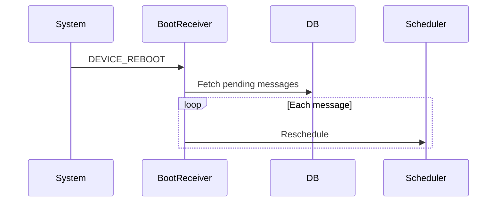

## ⏰ Scheduled Messaging System (Production-Grade)

A reliable message scheduling system designed to work across app restarts, device reboots, network loss, and Doze mode — without blocking the UI or draining battery.

---

## 🎯 Tech Problems Solved

| Problem | Solution |
|------|--------|
| App killed or restarted | WorkManager persists tasks |
| Device reboot | BOOT_COMPLETED reschedules jobs |
| Doze / battery optimization | OS-compliant background execution |
| Network unavailable | Auto retry with constraints |

✔ No polling  
✔ Battery efficient  
✔ Scales to millions of users  

---

## 🧠 Components Used & Why

| Component | Purpose |
|--------|--------|
| **WorkManager** | Reliable background task scheduling |
| **AlarmManager** | Exact trigger for time-sensitive jobs |
| **BroadcastReceiver** | Handles reboot & alarm callbacks |
| **Firestore** | Message persistence |
| **FCM** | Receiver notification |
| **Signal Protocol** | End-to-end encryption |

> WorkManager is the **source of truth**.  
> AlarmManager is used **only when exact timing is required**.
---

## 🔄 Scheduling Flow (Mermaid)

```mermaid
sequenceDiagram
    participant User
    participant UI
    participant VM as ViewModel
    participant DB as Room DB
    participant Alarm as AlarmManager
    participant WM as WorkManager

    User->>UI: Select date & time
    UI->>VM: scheduleMessage()
    VM->>DB: Insert scheduled message
    VM->>Alarm: setExactAlarm(time)
    VM->>WM: enqueue worker(delay)
    UI-->>User: Schedule confirmed
````

---

## ⚙️ Execution Flow (At Scheduled Time)

```mermaid
sequenceDiagram
    participant Alarm
    participant Receiver
    participant Worker
    participant DB
    participant Signal
    participant Firestore

    Alarm->>Receiver: Trigger broadcast
    Receiver->>Worker: Start worker
    Worker->>DB: Load scheduled message
    Worker->>Signal: Encrypt message
    Signal-->>Worker: Ciphertext
    Worker->>Firestore: Upload message
    Worker->>DB: Update status = sent
```

---

## 🔁 Boot Recovery Flow



---

## 🪜 Step-by-Step Working

### 📝 1. User Schedules Message

* Picks date & time
* Message saved in Room DB as `pending`

---

### ⏳ 2. Dual Scheduling

* **AlarmManager** → exact time trigger
* **WorkManager** → reliable execution

This avoids:
❌ missed triggers
❌ background kills
❌ timing drift

---

### 🕒 3. At Scheduled Time

* Alarm fires → BroadcastReceiver
* Worker launched
* Message loaded from DB

---

### 🔐 4. Secure Send

* Message encrypted using Signal Protocol
* Uploaded to Firestore
* Status updated to `sent`

---

### 🔄 5. Failure Handling

If sending fails:

* Worker retries
* Exponential backoff
* No duplicate sends

---

### 🔁 6. Reboot Safety

* BootReceiver reloads DB
* Re-schedules all pending messages

---

## 🧾 Message States

```
pending → sent → failed
```

| State   | Meaning                    |
| ------- | -------------------------- |
| pending | Waiting for scheduled time |
| sent    | Successfully delivered     |
| failed  | Permanent failure          |

---

## 🔐 Security Guarantees

* Encryption happens **before network call**
* No plaintext stored in Firestore
* Only local DB stores scheduled data
* Compatible with end-to-end encrypted chats

---

## ⚙️ Tech Stack

| Layer      | Technology         |
| ---------- | ------------------ |
| UI         | Jetpack Compose    |
| Storage    | Room DB            |
| Scheduling | AlarmManager       |
| Execution  | WorkManager        |
| Recovery   | BroadcastReceiver  |
| Encryption | Signal Protocol    |
| Delivery   | Firebase Firestore |

---

## 📁 Key Files

* `SendMessageWorker.kt` → background sender
* `ScheduleMessageDao.kt` → persistence
* `BootReceiver.kt` → reboot recovery
* `MessageReceiver.kt` → alarm handler
* `ScheduledMessagesScreen.kt` → UI
